# Modelo de datos

GradoHub · Universidad CESMAG

> **Generado automáticamente** desde el esquema real de PostgreSQL el 2026-09-15
> con `node backend/scripts/generate_er_diagram.js`.
>
> No se edita a mano: se regenera. Un diagrama dibujado a mano se queda atrás en
> cuanto alguien añade una tabla, y eso es exactamente lo que le pasó a los
> diagramas del documento de grado, a los que les faltaban seis tablas.

**26 tablas · 28 claves foráneas.**

---

## Diagrama entidad-relación

```mermaid
erDiagram
    academic_curricula {
        int curriculum_id PK
        int program_id FK "obligatorio"
        varchar version "obligatorio"
        int effective_year "obligatorio"
        varchar status "obligatorio"
        timestamp created_at "obligatorio"
        int total_semesters "obligatorio"
    }
    degree_options {
        int degree_option_id PK
        varchar name "obligatorio"
        text description
    }
    faculties {
        int faculty_id PK
        varchar name "obligatorio"
    }
    histories {
        int history_id PK
        text description
        varchar modified_field
        text old_value
        text new_value
        varchar change_type
        timestamp changed_at
        varchar user_id
    }
    modalities {
        int modality_id PK
        varchar name "obligatorio"
        text description
    }
    periods {
        int period_id PK
        int academic_year UK "obligatorio"
        int period_number UK "obligatorio"
        varchar description
    }
    permissions {
        int permission_id PK
        varchar name "obligatorio"
        text description
        bool is_active
    }
    program_periods {
        int program_period_id PK
        int program_id FK "obligatorio"
        int period_id FK "obligatorio"
    }
    programs {
        int program_id PK
        varchar name "obligatorio"
        int faculty_id FK
        int modality_id
    }
    project_bank {
        int project_bank_id PK
        varchar title "obligatorio"
        text description "obligatorio"
        text general_objective
        text specific_objectives
        int research_line_id
        int research_subline_id
        int program_id
        varchar keywords
        text observations
        varchar proposer_id "obligatorio"
        varchar proposer_role "obligatorio"
        varchar status "obligatorio"
        varchar assigned_student_id
        timestamp assigned_at
        timestamp created_at
        timestamp updated_at
    }
    project_bank_histories {
        int project_bank_history_id PK
        int project_bank_id "obligatorio"
        varchar user_id "obligatorio"
        varchar action "obligatorio"
        varchar previous_status
        varchar new_status
        jsonb changes
        timestamp created_at
    }
    project_histories {
        int project_history_id PK
        int project_id FK
        int history_id FK
    }
    projects {
        int project_id PK
        varchar title "obligatorio"
        varchar code UK
        timestamp created_at
        timestamp finished_at
        varchar letter_link
        int research_line_id FK
        int research_subline_id FK
        int status_id FK
        int modality_id FK
        int degree_option_id FK
    }
    research_documents {
        int document_id PK
        int project_id FK "obligatorio"
        varchar user_id FK "obligatorio"
        varchar document_type "obligatorio"
        varchar file_url "obligatorio"
        text observations
        timestamp delivered_at "obligatorio"
    }
    research_lines {
        int research_line_id PK
        varchar name "obligatorio"
        text description
        int program_id
    }
    research_progress {
        int progress_id PK
        int project_id FK "obligatorio"
        varchar user_id FK "obligatorio"
        text description "obligatorio"
        timestamp created_at "obligatorio"
    }
    research_sublines {
        int research_subline_id PK
        varchar name "obligatorio"
        text description
        int research_line_id FK
    }
    role_permissions {
        int role_permission_id PK
        int role_id FK
        int permission_id FK
    }
    roles {
        int role_id PK
        varchar name "obligatorio"
        text description
        bool is_active
    }
    semesters {
        int semester_id PK
        int semester_number "obligatorio"
        date start_date
        date end_date
    }
    statuses {
        int status_id PK
        varchar name "obligatorio"
        text description
    }
    students {
        int student_id PK
        varchar user_id FK "obligatorio"
        int semester_id FK "obligatorio"
        int curriculum_id FK "obligatorio"
    }
    user_permissions {
        int user_permission_id PK
        varchar user_id FK,UK "obligatorio"
        int permission_id FK,UK "obligatorio"
    }
    user_projects {
        int user_project_id PK
        int project_id FK
        varchar user_id FK
        varchar project_role
        timestamp started_at
    }
    user_roles {
        int user_role_id PK
        varchar user_id FK,UK
        int role_id FK,UK
        timestamp assigned_at
    }
    users {
        varchar user_id PK
        varchar full_name "obligatorio"
        varchar email UK "obligatorio"
        varchar password
        int program_id FK
        bool is_active
    }
    programs ||--o{ academic_curricula : "program_id"
    periods ||--o{ program_periods : "period_id"
    programs ||--o{ program_periods : "program_id"
    faculties ||--o{ programs : "faculty_id"
    histories ||--o{ project_histories : "history_id"
    projects ||--o{ project_histories : "project_id"
    degree_options ||--o{ projects : "degree_option_id"
    modalities ||--o{ projects : "modality_id"
    research_lines ||--o{ projects : "research_line_id"
    research_sublines ||--o{ projects : "research_subline_id"
    statuses ||--o{ projects : "status_id"
    projects ||--o{ research_documents : "project_id"
    users ||--o{ research_documents : "user_id"
    projects ||--o{ research_progress : "project_id"
    users ||--o{ research_progress : "user_id"
    research_lines ||--o{ research_sublines : "research_line_id"
    permissions ||--o{ role_permissions : "permission_id"
    roles ||--o{ role_permissions : "role_id"
    academic_curricula ||--o{ students : "curriculum_id"
    semesters ||--o{ students : "semester_id"
    users ||--o{ students : "user_id"
    permissions ||--o{ user_permissions : "permission_id"
    users ||--o{ user_permissions : "user_id"
    projects ||--o{ user_projects : "project_id"
    users ||--o{ user_projects : "user_id"
    roles ||--o{ user_roles : "role_id"
    users ||--o{ user_roles : "user_id"
    programs ||--o{ users : "program_id"
```



---

## Resumen de tablas

| Tabla | Columnas | Claves foráneas | Filas |
|---|---:|---:|---:|
| `academic_curricula` | 7 | 1 | 1 |
| `degree_options` | 3 | 0 | 3 |
| `faculties` | 2 | 0 | 5 |
| `histories` | 8 | 0 | 10 |
| `modalities` | 3 | 0 | 5 |
| `periods` | 4 | 0 | 5 |
| `permissions` | 4 | 0 | 7 |
| `program_periods` | 3 | 2 | 0 |
| `programs` | 4 | 1 | 2 |
| `project_bank` | 17 | 0 | 8 |
| `project_bank_histories` | 8 | 0 | 2 |
| `project_histories` | 3 | 2 | 8 |
| `projects` | 11 | 5 | 20 |
| `research_documents` | 7 | 2 | 0 |
| `research_lines` | 4 | 0 | 7 |
| `research_progress` | 5 | 2 | 0 |
| `research_sublines` | 4 | 1 | 13 |
| `role_permissions` | 3 | 2 | 26 |
| `roles` | 4 | 0 | 6 |
| `semesters` | 4 | 0 | 3 |
| `statuses` | 3 | 0 | 5 |
| `students` | 4 | 3 | 2 |
| `user_permissions` | 3 | 2 | 0 |
| `user_projects` | 5 | 2 | 45 |
| `user_roles` | 4 | 2 | 57 |
| `users` | 6 | 1 | 56 |

---

## Cómo leer el diagrama

- **PK** — clave primaria.
- **FK** — clave foránea: apunta a otra tabla.
- **UK** — valor único dentro de la tabla.
- `"obligatorio"` — la columna no admite nulos.
- Cada línea entre dos tablas lleva el nombre de la columna que las relaciona.

## Cómo regenerarlo

```bash
node backend/scripts/generate_er_diagram.js
```

Conviene volver a ejecutarlo después de cualquier cambio en el esquema, y antes
de entregar el documento de grado.
